  

## 📌 About Me
- Backend-leaning developer, now vibe-coding daily
- 🔨 Currently building multiple small products, documenting the process
- 🧠 Background in Java, Spring Boot, Django, and backend architecture
- 🌱 Exploring LangChain, AI-assisted development, and shipping fast
- 📺 Following along? Check my pinned repos and streams below

  

## 🛠️ Languages & Tools

<h3 align="center">Programming Languages</h3>

  &nbsp;&nbsp;
  

<h3 align="center">Backend</h3>

  &nbsp;&nbsp;
  

<h3 align="center">Database</h3>

  &nbsp;&nbsp;
  &nbsp;&nbsp;
  

<h3 align="center">DevOps & Cloud</h3>

  &nbsp;&nbsp;
  &nbsp;&nbsp;
  &nbsp;&nbsp;
  

<h3 align="center">Tools</h3>

  &nbsp;&nbsp;
  

## 🔗 Connect with Me

  &nbsp;
  

<!-- 

 -->

